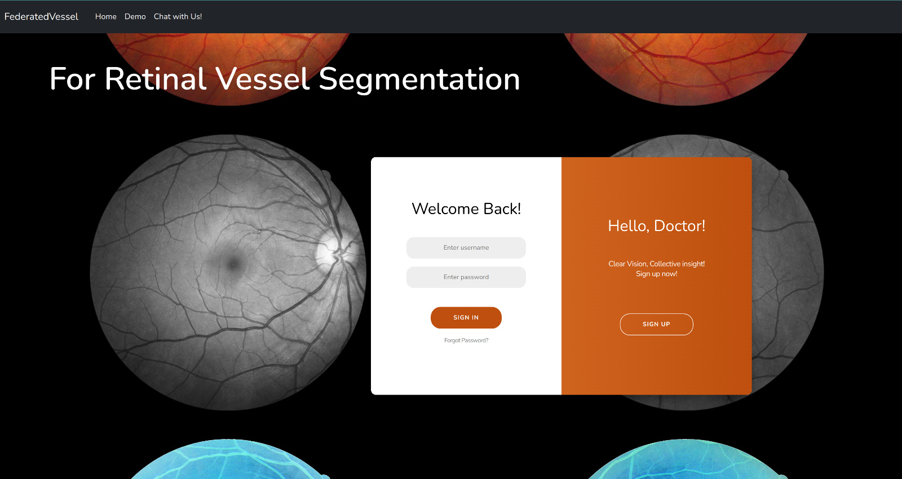
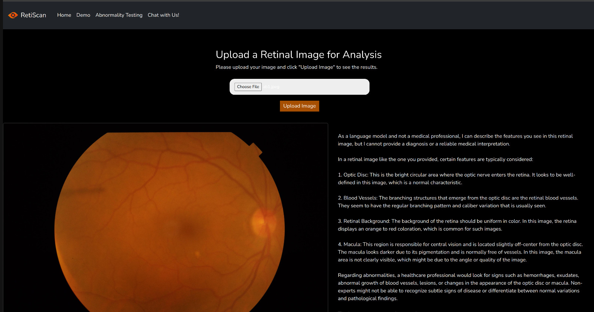
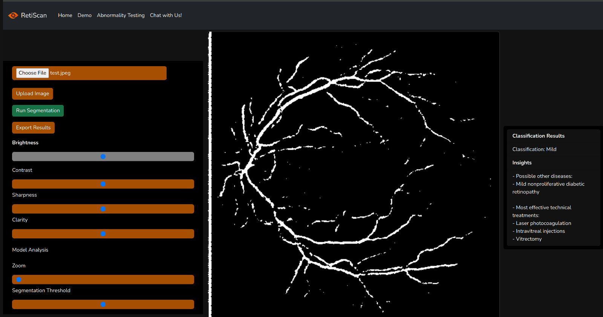
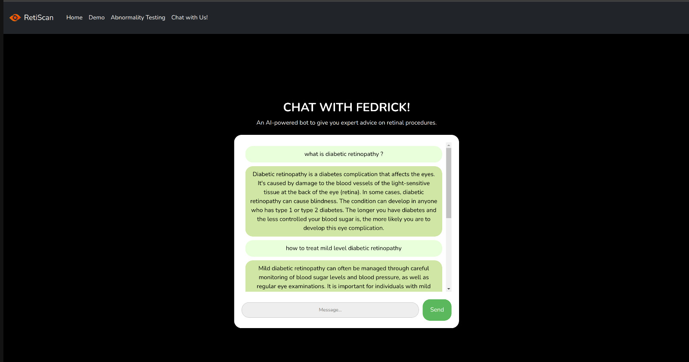

# RetiScan

<p align="center">
  
</p>

RetiScan leverages a federated learning approach for retinal vessel segmentation.
### Key Features:
- **Retinal Vessel Segmentation**
- **Diabetic Retinopathy Detection**
- **Prediction of Other Diseases and Effective Treatments**
- **Chatbot for Medical Advice**
- **Abnormality Testing and Retinal Image Analysis Interface**

<p align="center">
  
</p>

## About The Project

RetiScan is a state-of-the-art tool for the segmentation of retinal vessels using a federated learning approach. Addressing the scarcity of medical datasets due to privacy concerns, this project aims to enhance the diagnosis and monitoring of fundus, vascular, systemic, and neurological diseases through advanced retinal imagery analysis.

## Objectives
- Create a tool for retinal segmentation via federated learning.
- Enhance segmentation techniques.
- Integrate with an LLM to provide additional insights.

## Built With

- [](https://reactjs.org/)
- [](https://pytorch.org/)
- [](https://flask.palletsprojects.com/)
- [](https://firebase.google.com/)
- [](https://openai.com/)


## Getting Started

To get a local copy up and running follow these simple steps.

### Prerequisites

This project requires Node.js and Python3 to be installed on your system.

### Installation

1. Clone the repository:
   ```sh
   git clone https://github.com/Mughees2001/RetiScan
   ```
2. Navigate to the project directory and install NPM packages for the frontend:
   ```sh
   npm install
   ```

3. Install dependencies for backend:
   ```sh
   cd server
   pip install -r requirements.txt
   ```

4. Placing the API_KEYS for Firebase & OpenAI:

    Open the .env file in the project directory (RetiScan) and add the following lines:
    ```sh
    REACT_APP_FIREBASE_API_KEY=<Your Firebase API Key>
    REACT_APP_FIREBASE_AUTH_DOMAIN=<Your Firebase Auth Domain>
    REACT_APP_FIREBASE_PROJECT_ID=<Your Firebase Project ID>
    REACT_APP_FIREBASE_STORAGE_BUCKET=<Your Firebase Storage Bucket>
    REACT_APP_FIREBASE_MESSAGING_SENDER_ID=<Your Firebase Messaging Sender ID>
    REACT_APP_FIREBASE_APP_ID=<Your Firebase App ID>
    REACT_APP_FIREBASE_MEASUREMENT_ID=<Your Firebase Measurement ID>

    # OpenAI API Key
    OPENAI_API_KEY=<Your OpenAI API Key>
      ```
    Replace \<Your Firebase API Key> and \<Your OpenAI API Key> [GPT 4] with your actual API keys obtained from Firebase and OpenAI.


### Usage

Use the following commands in the project directory to start the application.

1. To run the frontend:
    ```sh
    npm start
   ```
2. To run the servers:
    ```sh
    cd server
    python3 predict.py
    python3 classify.py
    ```

## Front end

The front end of RetiScan is designed to provide a user-friendly interface for medical professionals. It includes secure authentication, a training interface, segmentation tools, and an AI-powered chatbot for medical advice.

### User Authentication
The User Authentication screen provides secure login and sign-up options, ensuring that access to the application is kept confidential and safe.




### Abnormality Testing and Retinal Image Analysis Interface

This interface offers a streamlined solution for the examination of retinal images, providing users with initial insights into key retinal features. Designed for healthcare professionals, it assists in identifying potential retinal conditions, supporting further expert analysis.




#### Features of the Interface:
- **Image Upload**: Users can easily upload retinal images using the "Choose File" button, which supports common image formats like JPG, JPEG, and PNG.
- **Analysis and Insights**: Upon uploading an image, the system performs an analysis and presents information about key retinal features such as the optic disc, blood vessels, retinal background, and macula. 
- **Descriptions**: The interface provides descriptive text that helps users understand the typical characteristics of a healthy retina and points out notable features that may require further medical investigation.


### Interface for Segmentation
The Interface for Segmentation is a tool that allows users to upload retinal images and perform vessel segmentation. Users can adjust settings like brightness, contrast, and sharpness to enhance the image before running the segmentation. The interface is user-friendly and designed to provide clear and accurate segmentation results.




### Chatbot for Medical Advice
RetiScan also includes a Chatbot for Medical Advice, named FEDRICK. This AI-powered bot provides expert advice on retinal procedures and diagnoses. It's an interactive feature that aids doctors and medical staff by offering instant responses to their queries, making the decision-making process faster and more informed.




## Contributing

Contributions make the open-source community an incredible place for learning, inspiring, and creating. Any contributions you make are **greatly appreciated**.


### Contributors

- **Mughees Ur Rehman**
  - [Mughees2001](https://github.com/Mughees2001/)

- **Saleha Muzammil**
  - [saleha-muzammil](https://github.com/saleha-muzammil)
